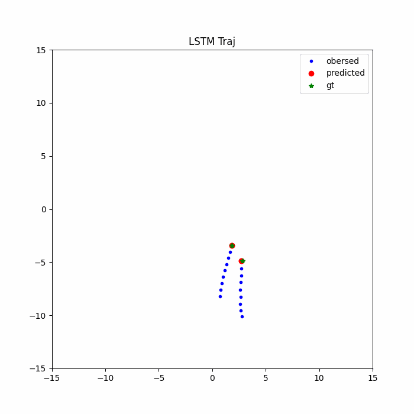

# Trajectory Prediction using a simple LSTM Encoder Decoder
This repository contains assignment from `KAIST ME455 Trajectory Prediction`

## How to run the code
- open the `test.ipynb` file
- run the cells

## Result
- the result is cherry picked 😋  
- so you may not see the same result  
